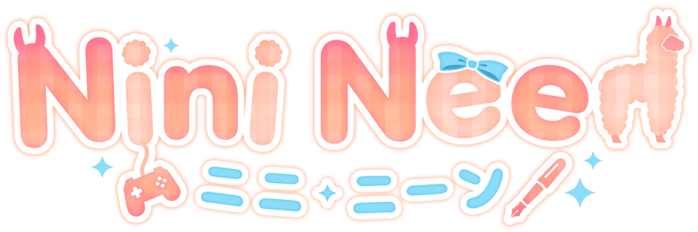
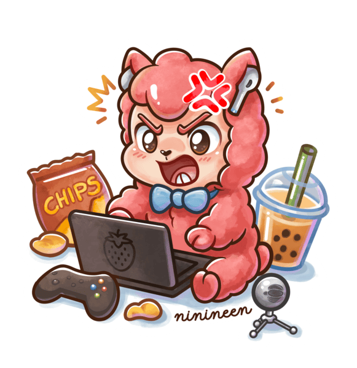

### 👩‍💻 Frontend Developer by day, LlamaPaca anime girl by night.

Senior Frontend Engineer building clean UIs during the day, and moonlighting as a Virtual Content Creator (**NiniNeen**) after hours. 

  
  
  
  
  
  
  
  

---

### 🛠️ What I'm Building

* 👾 **Stream Widgets:** Custom web-tech and tools to elevate stream overlays.
* 🧪 **Toy Projects:** Experimental frontend ideas and creative coding sandboxes.
* 📝 **AO3 Skin Crafting:** CSS layout tricks to perfect the formatting and presentation of my favorite <s>yaoi</s> fanfics.

*Always over-engineering things for the aesthetic.* ✨

---

### 🧰 Tech Stack & Tools

  
  
  
  
  
  
  

---

💖 Streaming, coding, and writing very gay fiction.

Profile picture by <a href="https://x.com/BenteJam">@BenteJam</a> |
Llama sticker by yours truly.
© NiniNeen. All images are all rights reserved.

